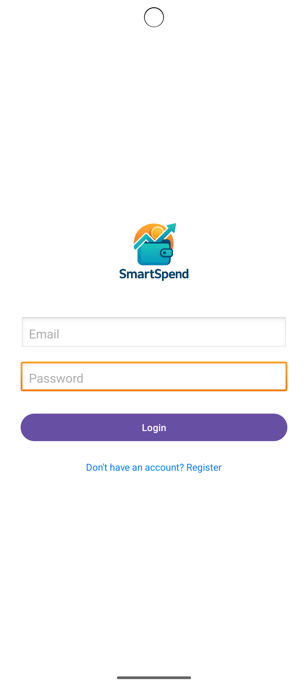
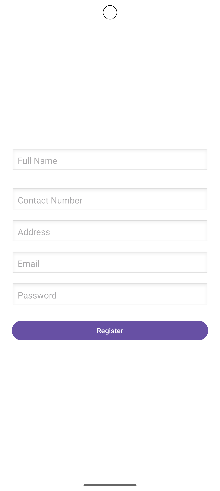
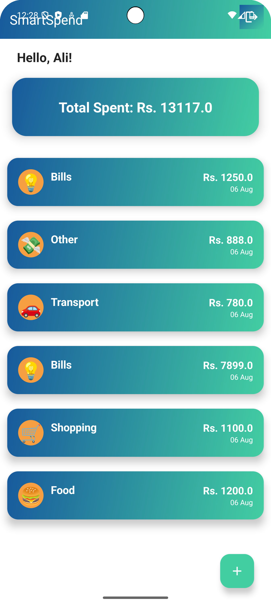

# 💸 SmartSpend – Personal Expense Tracker App

SmartSpend is a Kotlin-based Android app that helps users track their spending and manage their finances with ease.

## 🚀 Features

- 📲 Firebase Authentication (Login/Register)
- 🧾 Add & Delete Expenses
- 📊 Real-time Expense Display with Firebase Firestore
- 🧠 Simple and modern UI/UX with MVVM Architecture

## 📸 UI Screenshots

### 🔹 Splash Screen


### 🔹 Login Screen


### 🔹 Dashboard


## 🧰 Tech Stack

- Kotlin + Android SDK
- Firebase Authentication
- Firebase Firestore
- MVVM Architecture

## 🛠️ How to Run

1. Clone the repo:
   ```bash
   git clone https://github.com/your-username/SmartSpend-Kotlin.git
